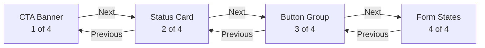
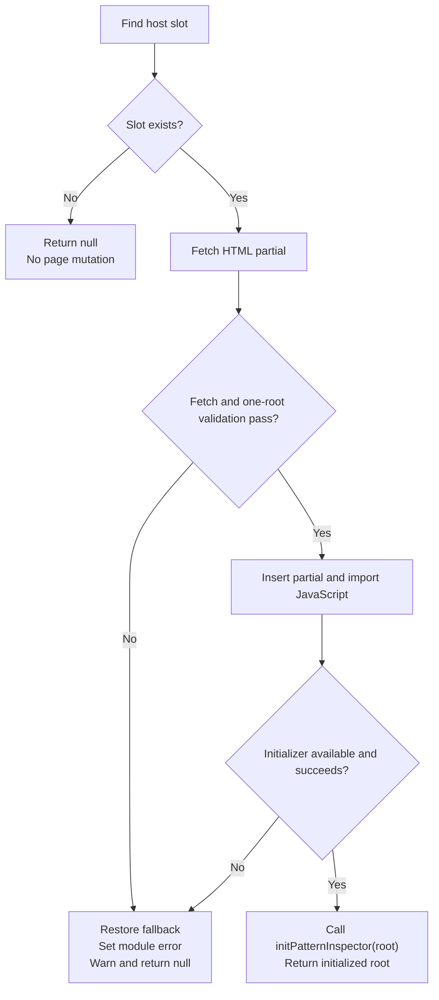
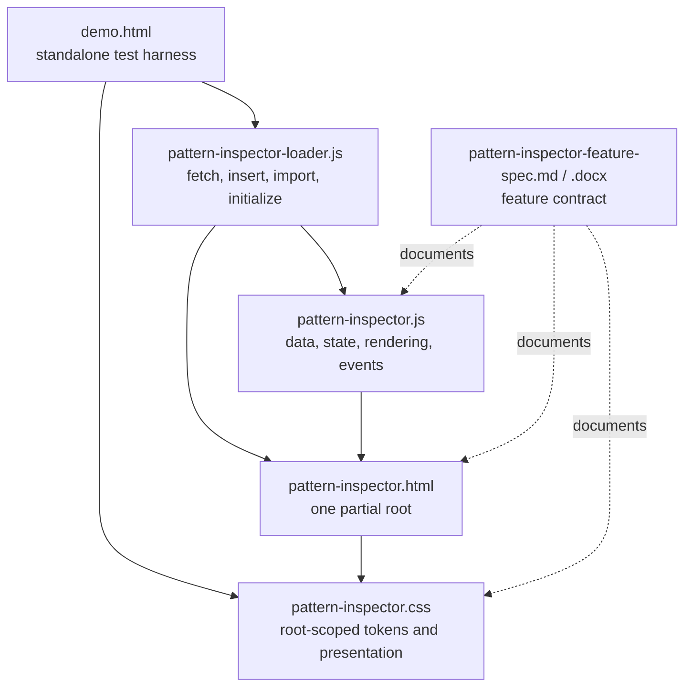
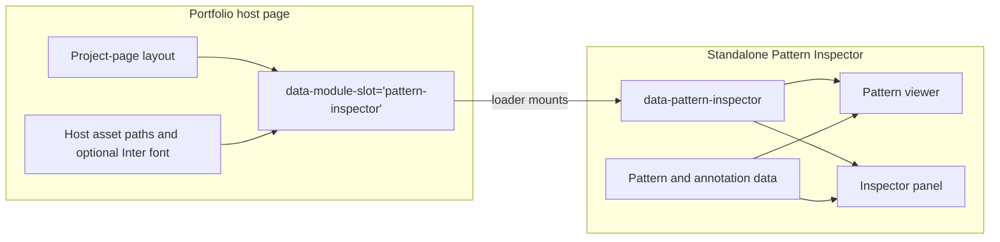
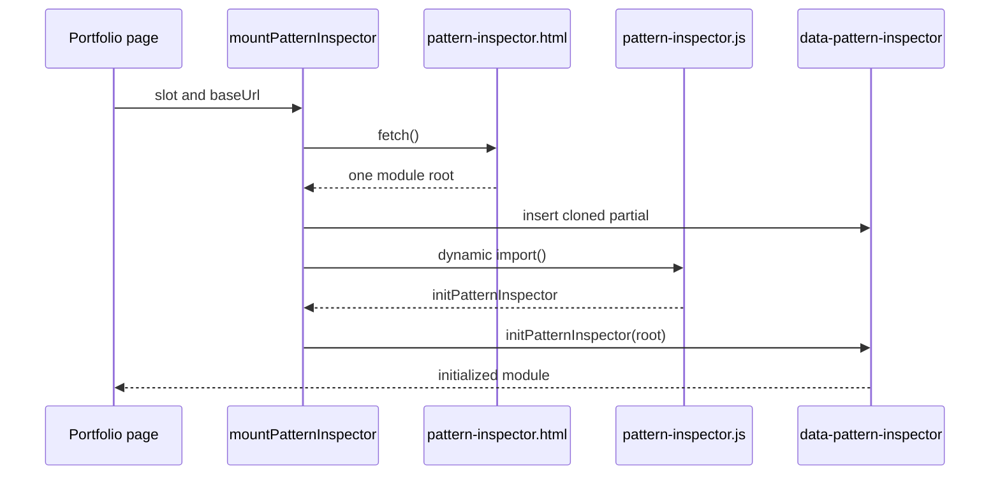
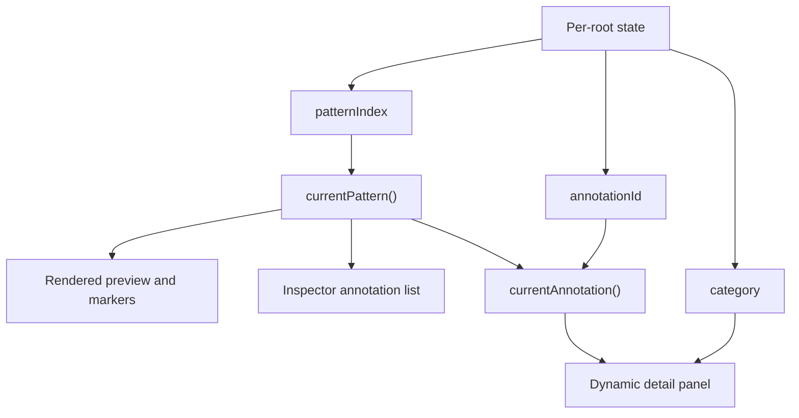
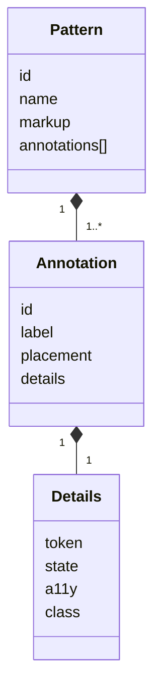
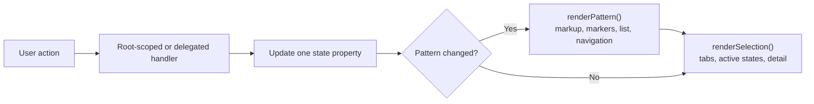

# Pattern Inspector Feature Specification

**Version:** 1.0.0  
**Document date:** July 23, 2026  
**Implementation baseline:** Approved Pass 3 integration package

## Document purpose

This specification defines the behavior, architecture, integration contract, known limitations, and future direction of the packaged Pattern Inspector. Statements labeled **Current** describe the implementation in `pattern-inspector.html`, `pattern-inspector.css`, `pattern-inspector.js`, and `pattern-inspector-loader.js`. Statements labeled **Future** are recommendations and are not implemented in this integration pass.

## Change history

| Version | Date | Change |
|---|---|---|
| 1.0.0 | July 23, 2026 | Initial formal specification for the approved Pass 3 module package. |

## 1. Feature overview

### 1.1 Purpose and problem

The Pattern Inspector presents a working interface pattern beside an explanatory Inspector. It lets a portfolio reader examine concrete elements of a pattern without leaving the project page or reading source code. Lettered markers make the relationship between visible interface elements and implementation metadata explicit.

The feature solves four related problems:

1. A static screenshot cannot explain which element a token, state, accessibility note, or class name belongs to.
2. A long implementation narrative separates the explanation from the visual target.
3. Multiple pattern examples require a consistent way to browse without duplicating the whole Inspector.
4. A portfolio project page needs a self-contained module that can be inserted after page load without global CSS or automatic JavaScript startup.

### 1.2 Embeddable role

The packaged Pattern Inspector is a framework-free ES module mounted into a host element marked `data-module-slot="pattern-inspector"`. The host loads `pattern-inspector.css`, fetches the HTML partial, imports the JavaScript, and calls `initPatternInspector(root)`. The partial is not a complete document and contains one root marked `data-pattern-inspector`.

The module owns its pattern data, rendering, controls, state, and scoped CSS. The portfolio owns the page shell, module slot, asset URLs, font availability, and the decision to mount or remove the module.

### 1.3 Core terms

- **Pattern:** One complete example rendered in the preview stage. The current set is CTA Banner, Status Card, Button Group, and Form States.
- **Annotated element:** A target inside the current pattern identified by `data-annotation-anchor`. It receives a lettered button whose ID corresponds to one annotation record.
- **Inspector category:** The metadata dimension selected by a tab: Token, State, Accessibility (displayed as “A11y” on the tab), or Class.
- **Dynamic detail panel:** The live region beneath the annotation list. It displays the selected category label and the corresponding value from the active annotation’s `details` object.

### 1.4 Pattern Inspector and future Design Inspector

The current Pattern Inspector explains one pattern at a time. A future Design Inspector would display a complete viewport containing multiple components and add component selection, screen or mode navigation, scaling, and richer metadata. The current interaction model remains foundational:

> The outline identifies the selected component in a full viewport; the lettered callout identifies the information being explained; the category tab determines which type of metadata is displayed.

Component selection must therefore remain a separate state from annotation selection and category selection.

## 2. Interaction patterns

### 2.1 Pattern navigation

`Prev` and `Next` are semantic buttons. They call `selectPattern()` with the adjacent zero-based index. The label `Pattern n of 4`, current pattern name, rendered markup, markers, annotation list, detail value, and disabled navigation states update together.

- Pattern 1 disables Previous.
- Pattern 4 disables Next.
- Out-of-range indexes passed through `selectPattern()` are ignored.
- Changing patterns resets the annotation to the new pattern’s first annotation and resets the category to `token`.

### 2.2 Annotation selection and synchronization

Every annotation is represented in two places:

1. A lettered `.pattern-annotation` button appended to its target.
2. A `.pattern-inspector__part` button in the ordered Inspector list.

Clicking either control sets `state.annotationId` and calls `renderSelection()`. The marker and list button with the same annotation ID both receive `.is-active` and `aria-pressed="true"`. All peers are cleared. The detail panel then reads the selected annotation’s value for the active category.

Marker letters are calculated from annotation order using A, B, C, and so on. The same order is used in the Inspector list. A missing target prevents only the preview marker from being created; the Inspector row still renders.

### 2.3 Category tabs

The tablist uses `role="tablist"`, each category uses `role="tab"`, and the shared content area uses `role="tabpanel"`. Clicking a tab updates `state.category`. Arrow Left and Arrow Right cycle through tabs; Home selects Token; End selects Class. Keyboard selection updates the detail immediately and moves focus to the newly selected tab.

The active tab has `.is-active`, `aria-selected="true"`, and `tabindex="0"`. Other tabs use `aria-selected="false"` and `tabindex="-1"`. The tab panel’s `aria-labelledby` value is synchronized to the active tab ID.

### 2.4 Independent state

The state object created for each initialized root is:

```js
{
  patternIndex: 0,
  annotationId: patterns[0].annotations[0].id,
  category: "token"
}
```

The properties are independently updated:

- `patternIndex` changes through Previous or Next.
- `annotationId` changes through a marker or Inspector row.
- `category` changes through a category tab.

Pattern changes intentionally reset the other two properties. Annotation changes preserve the pattern and category. Category changes preserve the pattern and annotation.

### 2.5 Input methods

**Keyboard.** Native buttons support Tab, Shift+Tab, Enter, and Space. The tablist additionally supports Arrow Left, Arrow Right, Home, and End. The implementation does not add arrow-key navigation among annotations or patterns.

**Pointer and touch.** Buttons and links use native click activation. Event delegation on the stage and annotation list resolves the nearest matching control with `closest()`. Touch behavior follows browser button behavior; no gesture navigation is implemented.

### 2.6 Responsive interaction

At widths above `56rem`, viewer and Inspector occupy two columns. At `max-width: 56rem`, the module becomes one column and the viewer border moves from its right edge to its bottom edge. At `max-width: 36rem`, spacing and display size reduce, the preview and Inspector body use smaller padding, pattern content narrows, forced CTA line breaks are removed, Form States becomes one column, and CTA actions stack. The CTA button target and button become full width with a minimum height of `2.75rem`; the text link remains centered below it.

Markers stay target-relative in every layout because each marker is appended to its own `data-annotation-anchor`. There is no card-level coordinate map or collision-detection engine.

## 3. User flows

### 3.1 Browsing all four patterns

1. The module loads CTA Banner as Pattern 1 of 4.
2. The user activates Next.
3. `patternIndex` advances after bounds checking.
4. The preview is replaced with Status Card markup.
5. The first Status Card annotation and Token category become active.
6. The title, count, markers, list, detail, and disabled states update.
7. The user repeats the action for Button Group and Form States.
8. Next is disabled on Form States; Previous remains available.



### 3.2 Selecting an annotated element

1. The user activates a lettered marker or matching Inspector row.
2. The delegated click handler reads its annotation ID.
3. `state.annotationId` changes.
4. `renderSelection()` synchronizes pressed and active states in both locations.
5. The detail panel displays the value for the active category.

### 3.3 Switching metadata categories

1. The user selects Token, State, A11y, or Class.
2. `state.category` changes to `token`, `state`, `a11y`, or `class`.
3. The tab’s selection and roving tab index update.
4. The detail label uses `categoryLabels`.
5. The detail value comes from `activeAnnotation.details[state.category]`.

### 3.4 Keyboard flow

1. Tab enters the module and reaches enabled native controls.
2. Enter or Space activates navigation or annotation buttons.
3. Within the category tablist, Arrow Left and Arrow Right wrap between tabs.
4. Home selects Token; End selects Class.
5. Focus follows the category selected with an arrow, Home, or End key.
6. Tab continues to the annotation list and subsequent controls according to DOM order.

### 3.5 Responsive flow

1. The viewport crosses `56rem`; the Inspector moves below the viewer.
2. The viewport crosses `36rem`; preview padding and pattern width reduce.
3. CTA actions change from a row to a column.
4. The CTA button becomes full width; the link is centered below it.
5. Form States changes from two columns to one.
6. Marker buttons remain attached to their targets.

### 3.6 Portfolio loading flow

1. The host page renders `<div data-module-slot="pattern-inspector"></div>`.
2. The host loads `pattern-inspector.css`.
3. A module script imports `mountPatternInspector()`.
4. The loader finds or receives the slot and resolves `baseUrl`.
5. It fetches `pattern-inspector.html`.
6. It validates that the response contains exactly one module root.
7. It saves existing slot content, inserts a cloned partial, imports `pattern-inspector.js`, and calls `initPatternInspector(root)`.
8. Initialization renders Pattern 1 and returns the root.

### 3.7 Safe recovery flow

If the slot is absent, the loader returns `null` without changing the page. If fetch, partial validation, import, or initialization fails, the loader restores the content previously in the slot, sets `data-module-error="pattern-inspector"`, logs a warning, and returns `null`. The host may retain a fallback message or replace it after a `null` result.



## 4. Architecture diagrams

### 4.1 Module file structure



### 4.2 Host-page mounting and separation



### 4.3 HTML slot to initializer



### 4.4 Internal state relationships



### 4.5 Pattern and annotation data



### 4.6 Event-to-render flow



## 5. Feature behaviors

| Behavior | Current expected result |
|---|---|
| Initial load | The loader inserts one partial and calls the initializer. Direct initialization requires a valid `data-pattern-inspector` root. |
| Default pattern | CTA Banner, `patternIndex: 0`, displayed as Pattern 1 of 4. |
| Default annotation | The first annotation for CTA Banner: Background Color (`background`). |
| Default category | Token (`category: "token"`). |
| Pattern change | Bounds-check index; reset annotation to the first record; reset category to Token; rerender all synchronized content. |
| Annotation change | Preserve pattern and category; update both active controls and detail content. |
| Category change | Preserve pattern and annotation; update tabs, panel label, and detail content. |
| Responsive change | CSS changes layout at `56rem` and `36rem`; JavaScript state is unchanged. |
| Focus change | Tab arrow/Home/End handling moves focus to the selected tab. Other activations retain native browser focus behavior. |
| Disabled navigation | Native `disabled` is applied to Previous on the first pattern and Next on the last. |
| Content overflow | `.pattern-inspector__detail-value` uses `overflow-wrap: anywhere`; the detail has a minimum height but may grow. |
| Active synchronization | Matching marker and list button share `.is-active` and `aria-pressed="true"`. |
| Module initialization | `initPatternInspector(root)` validates the root, attaches listeners, sets `data-inspector-initialized="true"`, and renders. |
| Repeated initialization | A root already marked initialized returns without adding listeners or rerendering. |
| Missing host slot | `mountPatternInspector()` returns `null` without logging or changing the document. |

## 6. Feature functionality

### 6.1 Pattern and annotation inventory

| Pattern | ID | Annotation inventory |
|---|---|---|
| CTA Banner | `cta-banner` | Background Color, Headline, Description, CTA Button, Text Link, Eyebrow |
| Status Card | `status-card` | Status Label, Status Title, Metadata, Manage Action |
| Button Group | `button-group` | Primary Action, Secondary Action, Supporting Copy |
| Form States | `form-states` | Default Field, Filled Field, Error Field, Inactive Field |

Every annotation contains an `id`, visible `label`, target-relative `placement`, and four detail strings: `token`, `state`, `a11y`, and `class`.

### 6.2 Annotation placement types

- `inside-top-right`: inside the target’s upper-right area.
- `cta-title`: CTA headline-specific positioning.
- `edge-left`: anchored to the left edge of its target.
- `edge-right`: anchored to the right edge of its target.

Placement is applied through `data-annotation-placement` on the generated marker. Marker ownership remains target-relative because the marker is appended to the matching `data-annotation-anchor`.

### 6.3 Accessibility support

Current support includes semantic buttons, visible focus outlines through `:focus-visible`, native disabled states, tab and tab-panel roles, roving tab index, `aria-selected`, `aria-controls`, synchronized `aria-pressed`, descriptive marker labels, an `aria-live="polite"` and `aria-atomic="true"` detail region, structured headings, form labels, `aria-invalid` on the error example, and native `disabled` on the inactive input. Reduced-motion CSS reduces animation and transition duration.

This pass preserves existing behavior; it is not a complete Pass 4 accessibility audit. Fixed IDs, focus behavior after pattern changes, and multi-instance semantics remain known limitations.

### 6.4 Feature inventory

| Feature | Purpose | Input | Output | State dependency | Implementation location |
|---|---|---|---|---|---|
| Pattern data | Define available examples | Pattern objects | Markup and annotation records | None | `patterns` in `pattern-inspector.js` |
| Pattern navigation | Browse examples | Previous/Next click | New pattern, count, controls | `patternIndex` | `selectPattern()`, `renderPattern()` |
| Preview renderer | Display current pattern | `pattern.markup` | Stage HTML | `patternIndex` | `renderPattern()` |
| Marker generator | Connect data to targets | Annotation and anchor IDs | Lettered target buttons | Pattern and annotation order | `createPreviewAnnotations()` |
| Inspector list | Provide parallel selection UI | Annotation array | Ordered semantic buttons | Pattern and annotation order | `createInspectorParts()` |
| Annotation selection | Select an element | Marker or list click | Synchronized active state | `annotationId` | Delegated click handlers, `renderSelection()` |
| Category tabs | Choose metadata dimension | Click or tab keys | Active tab and detail type | `category` | Tab listeners, `renderSelection()` |
| Dynamic detail | Explain selected target | Annotation details and category | Label and value | `annotationId`, `category`, `patternIndex` | `renderSelection()` |
| Responsive layout | Preserve use across widths | CSS viewport queries | Two-column or stacked layouts | No JavaScript state | `pattern-inspector.css` |
| Module initializer | Activate inserted partial | Valid root element | Listeners and first render | Per-root closure | `initPatternInspector(root)` |
| Loader | Mount in portfolio slot | Slot and `baseUrl` | Inserted, initialized root or `null` | Mount operation | `pattern-inspector-loader.js` |
| CSS scoping | Prevent host leakage | Module root selector | Contained visual rules | None | `[data-pattern-inspector]` selectors |

### 6.5 Retained dependencies

The module has no framework or third-party JavaScript dependency. Required design tokens are declared on `[data-pattern-inspector]`, so the module does not depend on external token or base stylesheets. The font stack prefers Inter when the portfolio already supplies it and falls back to system sans-serif fonts. The loader depends on standard browser support for ES modules, dynamic `import()`, `fetch()`, `URL`, templates, and modern DOM APIs.

## 7. Edge cases

The table distinguishes implemented handling from recommended fallback behavior. “Log” describes the intended observable behavior; direct initializer failures currently do not add custom logging unless the caller catches them.

| Edge case | Expected behavior | Fallback behavior | Log? | Interface visible? |
|---|---|---|---|---|
| Missing pattern data | **Current limitation:** initialization reads the first pattern and would throw. | Loader restores previous slot content and returns `null`; future validation should render a neutral unavailable state. | Loader warns. | Fallback remains; module does not. |
| Missing annotation data | **Current limitation:** first-annotation access or selection rendering may throw. | Loader restores fallback during initial mount; future validation should skip invalid patterns. | Loader warns during mount. | Fallback remains. |
| Missing category content | **Current limitation:** an absent detail key can produce an empty/undefined detail value. | Future implementation should display “Not documented.” | No current custom log. | Yes. |
| Fewer or more annotations | Supported; list and markers are generated from the array length and letters follow order. | Missing targets are skipped in the preview only. | No. | Yes. |
| Invalid active annotation ID | **Current limitation:** `currentAnnotation()` returns no record and detail rendering can throw. | Future normalization should select the pattern’s first valid annotation. | No current custom log. | May remain partially rendered. |
| Invalid active pattern index | `selectPattern()` ignores indexes below zero or at/above pattern count. | Keep current pattern and state. | No. | Yes. |
| Missing target element | Marker generation skips the missing anchor; its Inspector row still renders and can update details. | Keep the list-based path available. | No. | Yes. |
| Duplicate initialization | Protected by `data-inspector-initialized="true"`. | Return the same root without duplicate listeners. | No. | Yes. |
| Missing module root | Direct initializer returns `null`; loader rejects a partial without exactly one root. | Preserve or restore slot fallback. | Loader warns after fetched-partial validation. | Fallback remains. |
| Missing host slot | Loader returns `null` immediately. | Host page continues unchanged. | No. | Module absent; host remains. |
| Failed HTML fetch | Loader catches non-OK responses and network failures. | Restore previous slot content, set `data-module-error`, return `null`. | Yes, warning. | Fallback remains. |
| Failed JavaScript import | Loader catches import failure. | Restore previous slot content, set `data-module-error`, return `null`. | Yes, warning. | Fallback remains. |
| Long token or class names | Detail value wraps anywhere and the panel grows vertically. | Browser wrapping prevents horizontal overflow in the detail card. | No. | Yes. |
| Long accessibility descriptions | Same wrapping and growing behavior as other detail values. | Content may make the card taller. | No. | Yes. |
| Narrow viewport collisions | Responsive widths and stacked CTA actions reduce risk; there is no collision solver for markers. | Markers remain target-relative; future work should add collision testing or adaptive offsets. | No. | Yes, though collisions are possible. |
| Disabled JavaScript | The loader cannot fetch or initialize the partial. | Keep meaningful host fallback content or a static project-page explanation. | Browser-dependent. | Host fallback only. |
| Multiple instances | Separate roots can receive separate state closures when initialized individually. **Current limitation:** fixed IDs in the partial and rendered patterns would be duplicated. | Use one instance per page today; future loader should namespace IDs before initialization. | No. | Yes, but duplicate IDs are nonconforming. |
| Focus after pattern change | Native focus normally remains on the activated navigation button; annotation selection resets visually but does not receive focus. | Future work should define whether focus stays on navigation or moves to the new pattern heading/list. | No. | Yes. |

## 8. Module implementation instructions

### 8.1 Final module file structure

```text
pattern-inspector-integration/
├── demo.html
├── pattern-inspector.html
├── pattern-inspector.css
├── pattern-inspector.js
├── pattern-inspector-loader.js
├── pattern-inspector-feature-spec.md
└── pattern-inspector-feature-spec.docx
```

### 8.2 Host markup and stylesheet

```html
<link rel="stylesheet" href="/modules/pattern-inspector/pattern-inspector.css">

<section class="project-page__pattern-inspector">
  <div data-module-slot="pattern-inspector">
    <p>Loading Pattern Inspector…</p>
  </div>
</section>
```

The wrapping project-page section is owned by the portfolio. Module selectors do not target it.

### 8.3 Loader and initializer call

```html
<script type="module">
  import { mountPatternInspector }
    from "/modules/pattern-inspector/pattern-inspector-loader.js";

  const slot = document.querySelector(
    '[data-module-slot="pattern-inspector"]'
  );

  const root = await mountPatternInspector({
    slot,
    baseUrl: "/modules/pattern-inspector/"
  });

  if (!root) {
    console.info("Pattern Inspector fallback remains available.");
  }
</script>
```

`baseUrl` must resolve to the directory containing `pattern-inspector.html` and `pattern-inspector.js`. The CSS URL is loaded separately by the host.

### 8.4 HTML partial contract

The fetched file contains one root and no document-level elements:

```html
<section
  class="pattern-inspector"
  aria-labelledby="pattern-inspector-title"
  data-pattern-inspector
>
  <!-- Viewer and Inspector panel -->
</section>
```

### 8.5 Direct dynamic initialization

A host may use its own fetch pipeline and call the initializer directly:

```js
const slot = document.querySelector(
  '[data-module-slot="pattern-inspector"]'
);
const response = await fetch("/modules/pattern-inspector/pattern-inspector.html");
const html = await response.text();
slot.innerHTML = html;

const root = slot.querySelector("[data-pattern-inspector]");
const { initPatternInspector } = await import(
  "/modules/pattern-inspector/pattern-inspector.js"
);
initPatternInspector(root);
```

The loader is preferred because it validates the root and restores fallback content on failure.

### 8.6 Root-scoped query rule and timing

Call `initPatternInspector(root)` only after the partial has been inserted. All internal controls are queried from `root`, its stage, or its annotation list. Importing `pattern-inspector.js` alone does not initialize anything. Do not replace the initialized root’s internal HTML without mounting a new root and initializing it.

### 8.7 Local development

ES module imports and HTML fetching require an HTTP server:

```bash
cd /path/to/pattern-inspector-integration
python3 -m http.server 4180
```

Open `http://localhost:4180/demo.html`. Do not test through `file://`.

### 8.8 Relative and deployment paths

Deploy the partial and both JavaScript files together, or pass a `baseUrl` that points to their actual directory. The stylesheet may live elsewhere if its host `<link>` is updated. If assets are cross-origin, the server must allow the fetch and module import through correct CORS and MIME-type headers.

### 8.9 More than one instance

The current initializer creates state in a closure per root:

```js
document.querySelectorAll("[data-pattern-inspector]").forEach((root) => {
  initPatternInspector(root);
});
```

However, the current partial and rendered pattern markup contain fixed IDs. Therefore, deploying multiple simultaneous instances is not recommended until IDs and matching ARIA references are namespaced per instance. Calling `mountPatternInspector({ slot })` separately for each host slot also requires this namespacing improvement.

### 8.10 Removal or temporary disabling

To remove an instance safely, replace or remove its host-slot children. The listeners are attached inside the discarded subtree and become collectible when no references remain:

```js
const slot = document.querySelector(
  '[data-module-slot="pattern-inspector"]'
);
slot.replaceChildren();
slot.removeAttribute("data-module-error");
```

To disable mounting without changing module code, omit the host slot or do not call `mountPatternInspector()`. There is no public destroy method, state persistence API, or runtime enabled/disabled option in the current implementation.

## 9. Future Design Inspector preparation

All items in this section are **Future recommendations**, not current functionality.

### 9.1 Preview and selection model

- Add a full-screen or bounded viewport preview container capable of rendering complete screens.
- Register multiple inspectable components inside each screen.
- Draw a selected-component outline independently from annotation markers.
- Preserve the existing lettered callout system for the selected component’s information targets.
- Keep `selectedComponentId`, `annotationId`, and `category` as separate state.
- Add screen or mode navigation without overloading current pattern navigation.
- Generate a dynamic component inventory for the active screen or mode.

The interaction distinction must remain explicit:

1. The outline identifies the selected component in a full viewport.
2. The lettered callout identifies the information being explained.
3. The category tab determines which type of metadata is displayed.

### 9.2 Viewport systems

- Introduce viewport scaling that preserves actual design proportions.
- Define zoom bounds, zoom controls, fit-to-window behavior, and optional pan.
- Provide responsive viewport presets such as desktop, tablet, and mobile.
- Decide whether breakpoint changes rerender data, resize a live preview, or select a stored screen variant.
- Handle nested component boundaries and select the nearest registered inspectable parent.

### 9.3 Metadata architecture

- Move patterns and annotations into validated metadata registries.
- Add screen, mode, component type, parent, token, class, and accessibility metadata.
- Support multiple component types per screen and mode-specific data overrides.
- Add token and class extraction pipelines with explicit source provenance.
- Link metadata to future design-system documentation.
- Define export or handoff formats for engineering and design tools.
- Namespace all IDs so multiple inspectors and nested previews remain valid.

### 9.4 Suggested future state

```js
{
  screenId: "account-overview",
  modeId: "desktop-default",
  selectedComponentId: "renewal-card",
  annotationId: "status-label",
  category: "token",
  viewportPreset: "desktop",
  zoom: 0.8,
  pan: { x: 0, y: 0 }
}
```

The future renderer should derive outlines from `selectedComponentId`, callouts from `annotationId`, and detail content from `category`, while screen/mode and viewport properties control the design canvas.

## 10. Recommended future enhancements

These recommendations are intentionally not implemented in this integration pass.

### 10.1 Near-term enhancements

- Add schema validation and normalization for pattern and annotation data.
- Provide explicit fallbacks for missing detail values and invalid IDs.
- Define focus behavior after pattern navigation.
- Namespace IDs and ARIA references per instance.
- Add an optional `destroyPatternInspector(root)` API.
- Add automated tests for navigation bounds, reset behavior, tabs, marker/list synchronization, loader failure, and breakpoints.
- Perform the planned Pass 4 accessibility and responsive refinement.
- Add adaptive marker collision checks for very narrow widths and long localized labels.

### 10.2 Design Inspector preparation

- Separate reusable data registries from the renderer.
- Add screen, mode, component, and viewport state without changing annotation/category semantics.
- Define inspectable-parent registration and nested boundary rules.
- Prototype full-viewport scaling, zoom, pan, and responsive presets.
- Establish metadata provenance and links to design-system documentation.
- Define component outline and letter-marker layering and focus order.

### 10.3 Optional advanced features

- Deep links that restore screen, component, annotation, and category state.
- Search and filtering across components, tokens, classes, or accessibility notes.
- Side-by-side breakpoint or mode comparison.
- Copy-to-clipboard for tokens and classes.
- Exportable inspection reports and implementation handoff bundles.
- Analytics for anonymous feature usage, subject to portfolio privacy requirements.
- Localization and bidirectional-layout support.

## Known limitations

- Pattern data is embedded in JavaScript rather than loaded from a validated external registry.
- The public API exposes initialization but not destruction, state retrieval, or programmatic selection.
- Fixed IDs limit valid simultaneous multi-instance use.
- Missing data and invalid active annotation IDs are not normalized.
- Missing annotation targets are silently skipped.
- Annotation markers have fixed placement rules and no collision solver.
- Focus does not move to the new pattern or reset annotation after navigation.
- Category tabs have enhanced keyboard behavior; annotation lists rely on normal button tabbing.
- The module requires JavaScript and modern browser module/fetch support.
- The current implementation preserves approved responsive behavior but has not completed the later Pass 4 audit.

## Glossary

| Term | Definition |
|---|---|
| Active annotation | The annotation whose marker and Inspector row are pressed and whose metadata appears in the detail panel. |
| Anchor | An element marked with `data-annotation-anchor` that receives a generated marker. |
| Category | One of `token`, `state`, `a11y`, or `class`. |
| Detail panel | The live region showing one metadata value for the active annotation and category. |
| Host slot | The portfolio-owned element marked `data-module-slot="pattern-inspector"`. |
| Initializer | The exported `initPatternInspector(root)` function. |
| Marker | A lettered `.pattern-annotation` button placed inside an anchor. |
| Module root | The single partial root marked `data-pattern-inspector`. |
| Pattern | A complete rendered example and its annotation records. |
| Target-relative placement | Marker positioning relative to its own annotated element rather than the preview card. |

## Manual validation checklist

- [ ] Serve the package over HTTP and open `demo.html`.
- [ ] Confirm exactly one module root is inserted and marked `data-inspector-initialized="true"`.
- [ ] Confirm CTA Banner loads as Pattern 1 of 4 with Background Color and Token selected.
- [ ] Navigate through Status Card, Button Group, and Form States.
- [ ] Confirm Previous is disabled on Pattern 1 and Next on Pattern 4.
- [ ] Confirm every pattern resets to its first annotation and Token after navigation.
- [ ] Confirm annotation counts are 6, 4, 3, and 4 respectively.
- [ ] Activate every marker and verify the matching Inspector row.
- [ ] Activate every Inspector row and verify the matching marker.
- [ ] Verify Token, State, A11y, and Class values update for multiple annotations.
- [ ] Verify Arrow Left, Arrow Right, Home, and End in the tablist.
- [ ] Verify Tab, Shift+Tab, Enter, and Space on native controls.
- [ ] At widths above `56rem`, confirm the viewer and Inspector are side by side.
- [ ] At or below `56rem`, confirm the Inspector moves below the viewer.
- [ ] At or below `36rem`, confirm CTA actions stack and the button is full width.
- [ ] Confirm D remains on the CTA button and E remains on the text link at all widths.
- [ ] Confirm Form States becomes one column at the small breakpoint.
- [ ] Confirm long detail values wrap rather than overflow horizontally.
- [ ] Call the initializer twice and confirm no duplicate controls or listeners appear.
- [ ] Remove the host slot and confirm the loader returns `null` without page damage.
- [ ] Test a failed partial URL and confirm fallback restoration and `data-module-error`.
- [ ] Confirm module CSS does not alter unrelated host-page elements.

## Final implementation-readiness summary

The approved Pass 3 Pattern Inspector is ready for single-instance integration into an existing portfolio project-page slot. It packages four data-driven patterns, target-relative annotations, synchronized selection, category-specific detail content, navigation boundaries, keyboard-enabled tabs, responsive behavior, scoped CSS, explicit initialization, and a failure-tolerant loader.

Production integration should preserve the current file relationships, serve assets with correct module and fetch headers, retain meaningful host fallback content, and keep one instance per page. Data validation, ID namespacing, lifecycle destruction, formal focus policy, collision handling, and broader accessibility refinement are recommended follow-up work and are not prerequisites for the approved single-instance portfolio use case.
